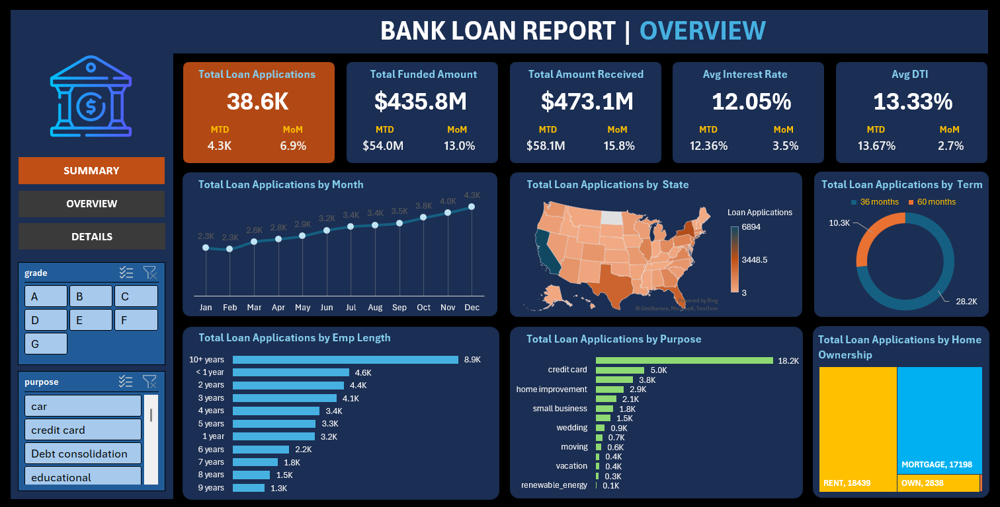
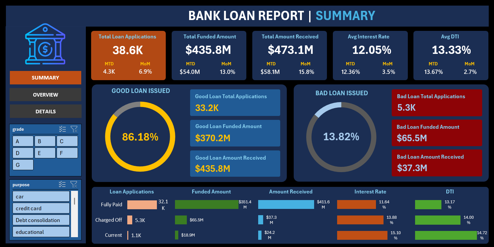

# Bank Loan Analysis Dashboard

An interactive Excel dashboard built to analyze bank loan performance and lending trends. This project converts raw loan data into an easy-to-understand dashboard using Pivot Tables, Pivot Charts, slicers, and KPI cards, making it easier to monitor lending activities and explore business insights.

---

## Dashboard Preview

### Overview Dashboard



---

## Project Highlights

- Built an interactive dashboard entirely in Microsoft Excel.
- Designed KPI cards to monitor loan applications, funded amount, repayments, interest rate, and DTI.
- Created dynamic visualizations using Pivot Tables and Pivot Charts.
- Added slicers for interactive filtering across multiple dashboard pages.
- Analyzed borrower demographics, loan purpose, loan term, employment length, and home ownership.

---

## About the Project

The goal of this project was to create a dashboard that helps track the overall performance of a bank's loan portfolio. Instead of going through thousands of records manually, users can quickly explore loan performance using interactive filters and visual reports.

The dashboard answers questions such as:

- How many loan applications were received?
- How much money has been funded and repaid?
- What percentage of loans are Good Loans and Bad Loans?
- Which states have the highest loan applications?
- Which loan purposes are most common?
- How does employment length or home ownership relate to loan applications?

---

## Dashboard Pages

### Summary Dashboard

The Summary page provides a quick snapshot of the bank's lending performance through KPI cards and loan quality analysis.

It includes:

- Total Loan Applications
- Total Funded Amount
- Total Amount Received
- Average Interest Rate
- Average Debt-to-Income Ratio (DTI)
- Good Loan vs Bad Loan Analysis
- Loan Status Breakdown



---

### Overview Dashboard

The Overview page provides a visual analysis of the dataset through interactive charts.

Charts included:

- Monthly Loan Application Trend
- State-wise Loan Distribution
- Loan Applications by Loan Term
- Loan Applications by Employment Length
- Loan Applications by Purpose
- Home Ownership Analysis

---

## Tools & Skills

- Microsoft Excel
- Pivot Tables
- Pivot Charts
- Slicers
- Conditional Formatting
- Excel Formulas
- Data Visualization
- Dashboard Design
- Business Analytics

---

## Dataset

The dashboard is built using a bank loan dataset containing information such as:

- Loan Status
- Loan Amount
- Funded Amount
- Amount Received
- Interest Rate
- Debt-to-Income Ratio (DTI)
- Issue Date
- Loan Purpose
- Home Ownership
- Employment Length
- State

---

## Folder Structure

```
Bank-Loan-Analysis-Dashboard
│
├── Dashboard
│   └── Bank Loan Dashboard.xlsx
│
├── Dataset
│   └── financial_loan_data.csv
│
├── Images
│   ├── dashboard-overview.png
│   └── dashboard-summary.png
│
└── README.md
```

---

## What I Learned

Working on this project helped me improve my understanding of:

- Designing interactive Excel dashboards
- Working with Pivot Tables and Pivot Charts
- Building KPI-based reports
- Presenting business data through effective visualizations
- Creating dashboards that are easy to explore using slicers

---

## How to Use

1. Download the Excel workbook.
2. Open **Bank Loan Dashboard.xlsx** in Microsoft Excel.
3. Enable editing if prompted.
4. Use the slicers to interact with the dashboard and explore different loan segments.

---

## Author

**Hrithik Doiphode**

If you have any suggestions or feedback, feel free to connect or explore my other projects.
